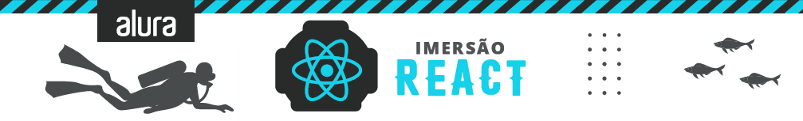

<!-- Badges session -->

  
  <!-- languages -->
  
  <!-- repo size -->
  
  <!-- last commit -->
  
  <!-- licence MIT -->
  

<!--Banner session-->

  

<!--About session-->
<h1 align="center">🤿 Imersão ReactJS 🤿 Alura</h1>

Nesta Imersão, o objetivo foi criar uma aplicação com React, do zero! Uma App utilizando React para você marcar e listar seus vídeos e filmes do YouTube.
- Entender a popularização do React, componentes, Create React App, Styled Components e fazer o primeiro deploy!
- Aprender sobre as páginas no estilo SPA, as vantagens do State e criação de um carrossel para os vídeos.
- Explorar a fundo a criação de componentes, reutilizar lógicas comuns com hooks e criar campos de formulários animados.
- Entender o protocolo HTTP, aprender como enviar e buscar dados de um back-end, adicionar suporte de validação em nossos campos e colocar a cópia do seu projeto no ar.

<b>Nesta imersão eu realizei a [PleiFlix](https://pleiflix.vercel.app), onde coloquei os conteúdos nos quais estou estudando, ainda tem mais conteúdos para catalogar, e serão realizados com o tempo.</b>

<h3>👨‍💻 Tecnologias utilizadas</h3>

- [HTML](https://developer.mozilla.org/en-US/docs/Glossary/HTML)
- [CSS](https://developer.mozilla.org/en-US/docs/Web/CSS)
- [JavaScript](https://developer.mozilla.org/en-US/docs/Web/JavaScript)
- [Node.JS](https://nodejs.org)
- [React.JS](https://pt-br.reactjs.org/docs/getting-started.html)
  - [Create React App](https://github.com/facebook/create-react-app)
  - [styled-components](https://marketplace.visualstudio.com/items?itemName=jpoissonnier.vscode-styled-components)
  - [react-router-DOM](https://reactrouter.com/web/guides/quick-start)
  - react-slick (carousel)
  - [EsLint](https://www.npmjs.com/package/eslint-plugin-jsx-a11y)

<h3>🚀 O que foi visto nas aulas</h3>

- <b>Aula 01 | <i>O que é React e componentes</i></b>
  - Nessa primeira aula de React finalizamos a home! E colocamos a <b>[PleiFlix](https://pleiflix.vercel.app)</b> no ar com Vercel. Usamos o <b>[Create React App](https://create-react-app.dev/docs/getting-started/)</b> para iniciar nosso projeto e <b>styled-components</b> para cuidar da camada de estilo da nossa aplicação, ferramentas essenciais do mundo React.

- <b>Aula 02 | <i>Roteamento e State</i></b>
  - Nessa aula aprendemos a lidar com o state do React e entender o que é uma <b>SPA <i>(Single Page Application)</i></b> além de dar mais vida para nossa home com mais efeitos visuais como o <b>carousel</b> de vídeos. São poucos os casos que não precisamos da biblioteca <b>react-router-dom</b> em projetos feito com React, exploramos bons detalhes dessa biblioteca e também aplicar uma biblioteca para fazer o nosso carousel na home chamada <b>react-slick</b>. A [Página 404](https://pleiflix.vercel.app/watch) aprensenta a tela com o jogo desenvolvido na [Imersão GameDev](https://github.com/Pleiterson/imersaogamedev-javascript).

- <b>Aula 03 | <i>Formulários reutilizáveis e mais componentes</i></b>
  - Nessa aula, entendemos como trabalhar com elementos dinâmicos na tela da aplicação.

- <b>Aula 04 | <i>AJAX e Validação</i></b>
  - Nesta aula construimos um servidor "portátil" (com <b>json-server</b>) e um banco de dados local. Além disso, fizemos a animação do campo de formulário no estilo Netflix!

- <b>Aula 05 | <i>Formulário de cadastro e remoção de vídeos</i></b>
  - Pra fechar o projeto, implementamos a funcionalidade que tornará possível o cadastro de novos vídeos! E ver como atualizar a home dinamicamente de acordo com o que for cadastrado.

<h3>📑 Vídeos e Conteúdos extras das aulas</h3>

- [Vitrine Alura](https://www.youtube.com/watch?v=4qy23EulMbw)
- [Como funciona o React?](https://www.youtube.com/watch?v=5MzOCxSWrrc)
- [Dicas de VSCode](https://www.alura.com.br/artigos/visualstudio-code-instalacao-teclas-de-atalho-plugins-e-integracoes)
- [Como criar um projeto com React Native](https://www.youtube.com/watch?v=k1vdmXDgMJI)
- [O que todo projeto deveria ter?](https://www.youtube.com/watch?v=yMRSDdifGW8)
- [Estilização CSS](https://www.youtube.com/watch?v=nDxp3YEpR1E&list=PLbcp5RKTX5wNF34qxISyWY6kignmhBQRT)
- [Vercel, deploy](https://vercel.com)
- [Como centralizar um elemento na tela, CSS](https://www.youtube.com/watch?v=Cu-HP-gvggg)
- [Aprenda forEach e map](https://www.youtube.com/watch?v=JbzcLKiTThk)
- [Layout do projeto no Figma](https://www.figma.com/file/rh7zm3wAz3SomVwby1iQYV/AluraFlix?node-id=181%3A10)
- [Criando o FlappyBird com JavaScript](https://www.youtube.com/watch?v=jOAU81jdi-c&list=PLTcmLKdIkOWmeNferJ292VYKBXydGeDej)
- [Pare de chutar CSS](https://www.youtube.com/watch?v=5PS6ku8NzIE)
- [GitHub airbnb](https://github.com/airbnb/javascript)
- [GitHub json-server](https://github.com/typicode/json-server)
- [Como fazer validação com React](https://www.youtube.com/watch?v=-nYNd6EuZHU)
- [Plugin de gravação do Chrome](https://chrome.google.com/webstore/detail/screencastify-screen-vide/mmeijimgabbpbgpdklnllpncmdofkcpn)

<!--License session-->
<h3>📝 Licença</h3>

Este projeto está sob a licença [MIT](./LICENSE).

<!--Bottom session-->
 <h4 align=center>Made with by <a target="_blank" href="https://pleiterson.vercel.app" >Pleiterson Amorim</a></h4>